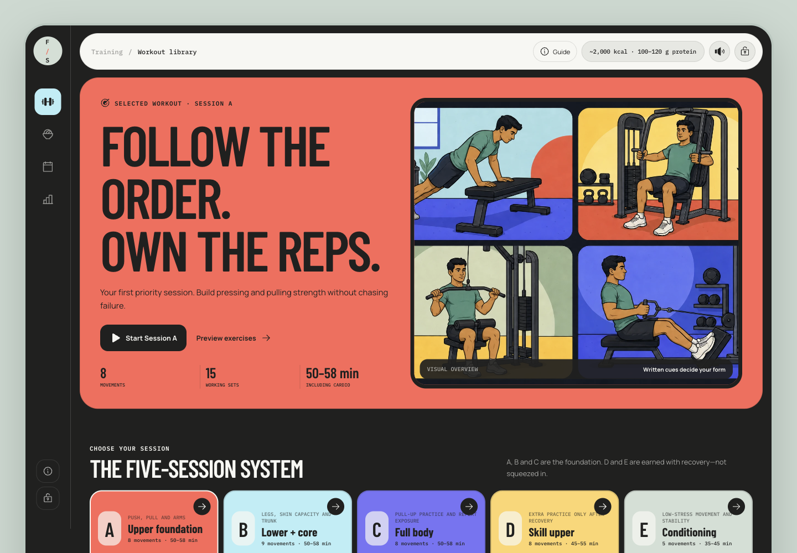
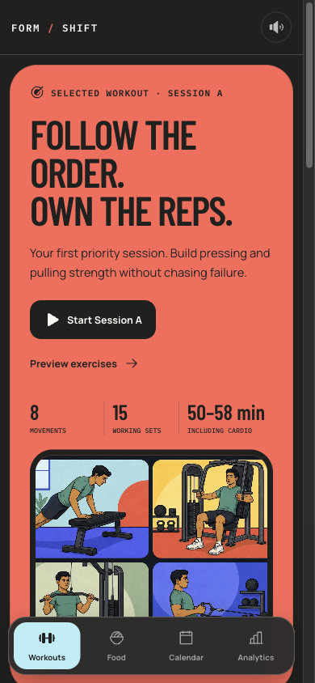

# FORM / SHIFT

FORM / SHIFT is a private, single-owner training journal built as a personal project. It combines a mobile-first workout runner, persistent training history, a lightweight weight log, and a practical food reference for a beginner training with machines, dumbbells, cables, and bodyweight.

The app is intentionally narrow: it helps one person execute the next workout cleanly, resume it on another device, and review what was actually recorded. It is not a social fitness platform, calorie tracker, or medical service.

## What it does

- Provides five rolling workout templates, with Sessions A–C as the foundation and D–E as optional additions.
- Guides every exercise with sets, repetitions, effort targets, equipment notes, written form cues, and a four-panel instruction image.
- Supports 20 exercise families, 30 equipment variants, and 30 dedicated instruction assets.
- Records individual set completion, exercise completion, exercise skips, variant choices, session start/end times, and incomplete sessions.
- Keeps one active workout resumable after reload, browser sleep, or browser closure.
- Shows a filterable Calendar with monthly totals, status/session filters, pattern readouts, weekly activity, and day-level workout details.
- Maps the current week's completed resistance and core sets across 12 selectable front/back body regions, with weighted exposure, direct work, supporting work, and training-day counts shown separately.
- Stores occasional body-weight measurements and uses an explicit select-then-edit flow so inspecting an entry cannot silently put the form into edit mode.
- Includes a searchable 76-item Food Index for no-cook combinations, simple pan recipes, fruit and vegetables, protein add-ons, and foods to limit, backed by 10 generic family guides.
- Compares up to four food portions against rough energy and protein references without turning the comparison into a prescribed meal plan.
- Provides high-output interaction tones with a persistent sound toggle, plus strong best-effort haptics on browsers that expose device vibration.
- Adapts from a desktop dashboard to a focused mobile runner and fixed bottom navigation.

## Screenshots

These are the canonical 2026-08-10 captures from the final desktop and mobile browser comparison. The protected journal was empty when the final release state was verified; the screenshots therefore show the real first-workout experience rather than seeded analytics.





## Architecture

```text
React 19 + Vite client
        |
        | same-origin JSON requests
        v
Vercel Functions under /api
        |
        | shared request handlers and domain rules
        v
Drizzle ORM + Neon serverless driver
        |
        v
Neon Postgres
```

The four-digit owner PIN is entered with the app's on-screen keypad and submitted only to the same-origin unlock function; it is not bundled into or returned to the client. The cookie-signing secret and database connection string remain server-side. Vercel Functions use Web `Request` and `Response` semantics, and the client sends the signed authentication cookie only to the same origin. The signed access cookie expires at the next 04:00 Chennai workout-day boundary, so the owner unlocks once each day.

Postgres enforces the two most important workout rules:

- Only one workout can be active for the owner at a time.
- Only one workout can be started in a logical training day, where the day changes at 04:00 in `Asia/Kolkata`.

Workout templates, exercise definitions, equipment variants, and muscle-exposure classifications are snapshotted when a session starts, so historical records remain meaningful if the source program changes later. Older records without exposure metadata use a tested stable-ID fallback.

## Local setup

### Prerequisites

- Node.js 20 or newer
- npm
- A Neon Postgres database
- Vercel CLI for the full local client-and-functions runtime

### 1. Install dependencies

```bash
npm ci
```

### 2. Configure local environment variables

```bash
cp .env.example .env.local
```

Fill the three placeholders in `.env.local`:

| Variable | Purpose |
| --- | --- |
| `DATABASE_URL` | Neon pooled Postgres connection string |
| `OWNER_PIN` | Private four-digit PIN used by the on-screen owner gate |
| `AUTH_COOKIE_SECRET` | Independent random signing secret with at least 32 characters |

Never commit `.env.local`. The repository ignores `.env` files except for the safe `.env.example` template.

### 3. Apply the database migrations

```bash
npm run db:migrate
```

This applies the checked-in migrations from `drizzle/`. Use `npm run db:generate` only after intentionally changing `server/db/schema.js`.

### 4. Start the full app locally

If the Vercel CLI is not already installed, either install it globally or run it through `npx`:

```bash
npx vercel dev
```

The first run may ask you to authenticate and link a local Vercel project. Open the local URL printed by the CLI and unlock the app with `OWNER_PIN`.

`npm run dev` starts only the Vite frontend. It is useful for isolated visual work, but the complete application requires the same-origin `/api` functions and database, so `vercel dev` is the recommended local command.

## Tests and production build

Run the complete automated test suite:

```bash
npm test
```

The test command covers action single-flight behavior, sound output and preference persistence, safe haptic patterns, Calendar filtering and metrics, weekly muscle-exposure classification, history calculations, daily authentication and signed-cookie expiry at the 04:00 boundary, server-safe date-only weight handling, workout invariants, workout-history shaping, template variants, journal-reset safeguards, schema safeguards, API authentication, and static-hosting packaging.

Build the production assets with:

```bash
npm run build
```

Vite writes the client to `dist/client`. The build also preserves the repository's alternate static-hosting handoff files; Vercel uses `vercel.json`, the client output, and the functions in `api/`.

## Project structure

```text
api/                 Vercel Function entry points
drizzle/             Versioned Postgres migrations
public/assets/       Workout, food, and exercise instruction artwork
server/api/          Shared HTTP handlers
server/db/           Drizzle schema, connection, and repository
server/domain/       Session invariants and history shaping
src/components/      Workout, food, calendar, analytics, and owner-gate UI
src/exerciseMuscles.js  Canonical exercise-to-muscle exposure metadata
tests/               Node test suites
```

## Deliberate boundaries

- Authentication is a single-owner PIN, not a multi-user account system.
- The workout journal, workout history, and weight entries are persistent. The food quick-compare tray is intentionally temporary and clears on reload.
- The sound preference persists only in the current browser; it is not owner data and is not synchronized between devices.
- Haptics depend on the browser's Device Vibration API and safely fall back to visual and sound feedback when that API is unavailable.
- The runner shows overall elapsed session time and written rest guidance. It does not run a rest countdown.
- Muscle exposure is a completed-set distribution, not load-based training volume, recovery advice, or evidence of muscle growth.
- Food energy and protein values are approximate references, not a personalized daily prescription.
- Exercise illustrations support the written cues; they are not a substitute for a qualified coach or clinical assessment when pain or injury symptoms are present.

## 2026-08-10 release state

Temporary authenticated QA rows were permanently removed after the final browser pass. A separate read-only count check then confirmed that the configured production journal contained exactly 0 workout sessions, 0 workout exercises, 0 workout sets, and 0 weight entries. The schema, migrations, environment configuration, and owner authentication remained intact.

See [PERSISTENCE.md](./PERSISTENCE.md) for the storage and API contract, [DESIGN_NOTES.md](./DESIGN_NOTES.md) for product-design decisions, and [design-qa.md](./design-qa.md) for the completed authenticated QA record.
